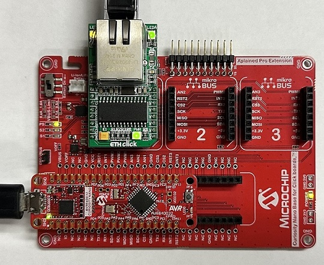
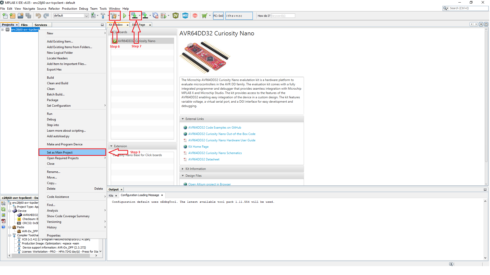
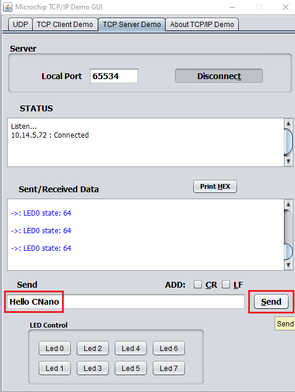
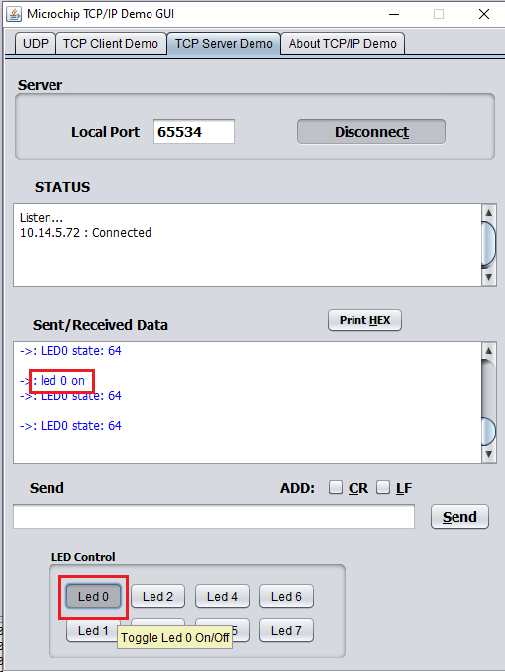
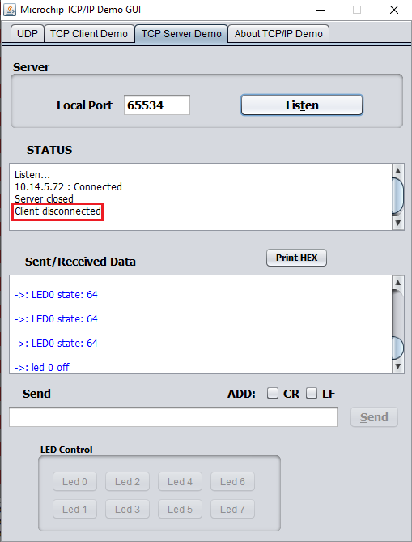

<!-- <a href="https://www.microchip.com"></a> -->

<a target="_blank" href="https://www.microchip.com/" id="top-of-page">
   <picture>
      <source media="(prefers-color-scheme: light)" srcset="images/mchp_logo_light.png" width="350">
      <source media="(prefers-color-scheme: dark)" srcset="images/mchp_logo_dark.png" width="350">
      
   </picture>
</a>

# TCP/IP Lite Solutions for AVR® Using ENC28J60

## Introduction

This repository provides MPLAB® X IDE projects that are suitable for the AVR Dx product family and contain solutions for User Datagram Protocol (UDP), as well as Transmission Control Protocol/Internet Protocol (TCP/IP) Client and Server demo applications.

## Hardware Requirements

1. [AVR64DD32 Curiosity Nano](https://www.microchip.com/en-us/development-tool/EV72Y42A)
2. [ETH Click](https://www.mikroe.com/eth-click)
3. [Curiosity Nano Base for Click Boards™](https://www.microchip.com/en-us/development-tool/AC164162)
4. RJ45 Network Connector Cable
5. USB 2.0 to Micro B Cable

## Software Requirements

1. [MPLAB X IDE v6.10 or later](https://www.microchip.com/en-us/tools-resources/develop/mplab-x-ide#tabs)
2. [MPLAB XC8 Compiler v2.41 or later](https://www.microchip.com/en-us/tools-resources/develop/mplab-xc-compilers/downloads-documentation#XC8)
3. [MPLAB Code Configurator (MCC) v5.3.7 or later](https://www.microchip.com/en-us/tools-resources/configure/mplab-code-configurator)
4. MCC Melody Core v5.5.7 or later
5. Ethernet Drivers Library v6.0.0
6. TCP/IP Lite Library v5.0.0
7. Microchip TCP/IP Demo GUI
8. [Wireshark Network Analyzer Tool](https://www.wireshark.org/)

## Related Documentation

1. [AVR64DD32 Data Sheet](https://www.microchip.com/en-us/product/AVR64DD32)
2. [ENC28J60](https://www.microchip.com/en-us/product/ENC28J60)
3. [Ethernet Drivers Library Release Notes](https://onlinedocs.microchip.com/oxy/GUID-F319A0CC-8179-4113-B2F3-AA69D1B2C216-en-US-4/GUID-8B345417-6295-49E6-ABEB-D2FA8A5D5561.html)
4. [TCP/IP Lite Library Release Notes](https://onlinedocs.microchip.com/oxy/GUID-AD30B8D1-D966-45C9-950F-6B266508AA41-en-US-4/index.html)

## Hardware Setup

1. Mount the AVR64DD32 Curiosity Nano board on the Curiosity Nano Base for Click boards and power it on using a USB 2.0 to Micro B Cable.
2. Mount the ETH Click board on the mikroBUS™ socket 1 of Curiosity Nano Base and connect to a network switch using a RJ45 network connector cable.
<br>

## TCP/IP Client Solution

1. Open MPLAB X IDE.
2. Select *File>Open Project>enc28j60-avr-tcpclient.X*.
3. Right click ```enc28j60-avr-tcpclient.X``` and select Set as Main Project.
<br>

4. Open the Command Prompt/Terminal window, type ```ipconfig``` and press 'Enter' to get the system IP address.
<br>

5. Modify the server IP address with your system IP address in the ```tcp_client_demo.c``` file under the ```TCP_Client_Initialize()``` function. Make a note of the ```remoteSocket.port``` set in the code.
```
void TCP_Client_Initialize(){
     
     //  Initialize the server IP address with your system IP address
    remoteSocket.addr.s_addr = MAKE_IPV4_ADDRESS(10, 14, 5, 127);
    remoteSocket.port = 65534;
}
```
6. Click **Clean and Build Main Project** and make sure the project builds successfully.
7. Click **Make and Program Device Main Project** and check that the programming is complete.
8. Open Wireshark Network Analyser Tool with Administrator Privileges. From the Capture menu, select an interface to which the board and PC are connected. Click **Start capturing packets**.
<br>

9. Add the following filters: ```dhcp||icmp||tcp.port==65534```.
<br>

10. Open Microchip TCP/IP Demo GUI. Go to the **TCP Server Demo** tab and assign the port number as **65534** (noted in Step 5), then click the **Listen** button. The status of the TCP connection is printed in the STATUS text box.
<br> 

11. After the connection is established:
* Type your text in the Send text box (e.g., 'Hello CNano') and click the **Send** button. The text sent is displayed in the Sent/Received Data box.
<br> 

* Switch back to Wireshark and observe the packets with your system IP address as the source
<br>

* Click the **Led 0** button in the **TCP Server Demo** tab to toggle the LED0 on the Curiosity Nano board
<br>

* Switch back to Wireshark and observe the packets with your system IP address as the source
<br>

12. Click the **Disconnect** button to close the TCP connection. A "Client disconnected" message will appear in the STATUS text box.
<br>

## TCP/IP Server Solution
1. Open MPLAB X IDE.
2. Select *File>Open Project>enc28j60-avr-tcpserver.X*.
3. Right click ```enc28j60-avr-tcpserver.X``` and select Set as Main Project.
<br>

4. Open Wireshark Network Analyser Tool with Administrator Privileges. From the Capture menu, select an interface to which the board and PC are connected. Click **Start capturing packets**.
<br>

5. Add the following filters: ```dhcp||icmp||tcp.port==7```.
<br>


6. Click **Clean and Build Main Project** and make sure the project builds successfully.
7. Click **Make and Program Device Main Project** and check that the programming is complete.
8. Switch to Wireshark Network Analyser Tool and wait to receive the Dynamic Host Configuration Protocol (DHCP) handshake packets. Click DHCP ACK and expand the 'Dynamic Host Configuration Protocol' field to reveal the details. Make a note of the IP address in 'Your (client) IP address'.
<br>

9. Open Microchip TCP/IP Demo GUI. Go to the **TCP Client Demo** tab and assign the port number as **7** and server IP address as **10.14.5.95** (noted in Step 8). Click the **Connect** button. The status of the TCP connection is printed in the STATUS text box.
<br> 

10. After the connection is established:
* Type your text in the Send text box (e.g., 'Hello CNano') and click the **Send** button. The text sent is displayed in the Sent/Received Data box.
<br> 

* Switch back to Wireshark and observe the packets with your server IP address as the source to check the response
<br>

11. Click the **Disconnect** button to close the TCP connection. A "Connection Closed" message will appear in the STATUS text box.
<br>


## TCP/IP UDP Solution
1. Open MPLAB X IDE.
2. Select *File>Open Project>enc28j60-avr-udp.X*.
3. Right click ```enc28j60-avr-udp.X``` and select Set as Main Project.
<br>

4. Open the Command Prompt/Terminal window, type ```ipconfig``` and press 'Enter' to get the system IP address.
<br>

5. Modify the server IP address with your system IP address in the ```udp_demo.c``` file under the ```UDP_Demo_Initialize()``` function. 
```
void UDP_Demo_Initialize(void)
{
    //Initialize the Destination IP address with your PC's IP address and Destination Port
     
    /* UDP Packet Initializations*/
    udpPacket.destinationAddress = MAKE_IPV4_ADDRESS(10,14,5,127);   
    udpPacket.destinationPortNumber = 65531;   
     
    udpPacket.sourcePortNumber = 65533;
}
```
6. Make a note of the ```udpPacket.destinationPortNumber``` you set in the code (anything in the range of dynamic ports).
7. Open Wireshark Network Analyser Tool with Administrator Privileges. From the Capture menu, select an interface to which the board and PC are connected. Click **Start capturing packets**.
<br>

8. Add the following filters: ```dhcp||icmp||udp.port==65531```.
<br>

9. Click **Clean and Build Main Project** and make sure the project builds successfully.
10. Click **Make and Program Device Main Project** and check that the programming is complete.
11. Switch to Wireshark Network Analyser Tool and wait to receive the Dynamic Host Configuration Protocol (DHCP) handshake packets. Click DHCP ACK and expand 'Dynamic Host Configuration Protocol' field to reveal the details. Make a note of the IP address in 'Your (client) IP address'.
<br>

12. Open Microchip TCP/IP Demo GUI:
* Go to the **UDP** tab and assign the port number as **65531** (noted in Step 5). Click the **Listen** button (Click 'Allow Access' if a warning occurs).
<br>

* Assign server IP address as **10.14.5.128** (noted in Step 11). Click the **Claim** button.
<br>

* Click **1** under the LED section to toggle LED0 on the Curiosity Nano board and observe the Wireshark capture
<br>
<br>


* Type your text in the Send Data box (e.g., 'Hello CNano') and click the **Send** button. Observe the packet in the Wireshark capture.
<br>
<br>

13. Press the SW0 switch on the Curiosity Nano board. Observe the packet which says 'Hello World' in the Wireshark capture.
<br>